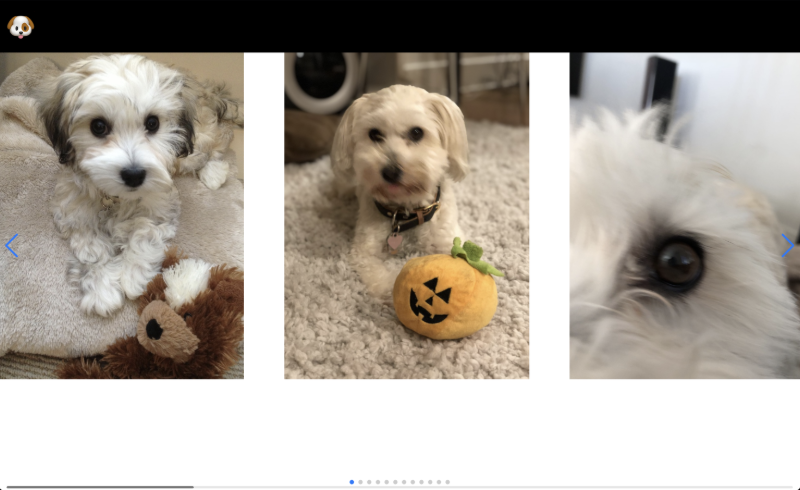

# Frontend Master Bootcamp: Swiper Gallery Project

## Introduction

This project is part 2 of the "Using JavaScript in Websites" course from the Frontend Masters Bootcamp. Part 1, which can be found [here](https://github.com/tak40/fm-bootcamp-interactive), involved creating a basic image gallery. This part focuses on an advanced version using libraries. It utilizes HTML, CSS, and JavaScript, along with the Swiper library for a smooth scrolling gallery and GSAP for animations. This project was a great way to revisit the basics of JavaScript while also learning how to integrate and use libraries.



You can view live version of the project [here](https://swiper-gallery-project.netlify.app/).

## Features

- **HTML and CSS**: Utilizes HTML for structure and CSS for styling the image gallery.
- **JavaScript**: Implements functionality to navigate through the gallery images using Swiper and GSAP libraries.
- **Swiper Library**: Provides a smooth scrolling gallery with pagination, navigation, and scrollbar.
- **GSAP**: Adds animation to the logo, making it draggable and interactive.

## Personal Learnings

While working on this project, I revisited and found several concepts interesting and important:

- **HTML and CSS Basics**: Reinforced the basics of structuring an HTML document and applying CSS styles.
- **Swiper Library**: Gained experience in integrating and configuring the Swiper library for a better user experience.
- **GSAP Animations**: Learned how to create interactive and draggable elements using GSAP.

## Acknowledgements

This project is part of the Frontend Masters Bootcamp, specifically focusing on HTML, CSS, and JavaScript lessons. Special thanks to the instructors for providing valuable lessons and resources. Learn more at [Frontend Masters Bootcamp](https://frontendmasters.com/bootcamp/) and [Using JavaScript in Websites](https://frontendmasters.com/bootcamp/javascript-in-websites/).

## Getting Started

To get started with this project, clone the repository and open the `index.html` file in your browser.

```sh
git clone https://github.com/tak40/fm-bootcamp-interactive-gallery2.git
cd fm-bootcamp-interactive-gallery2
open index.html
```
